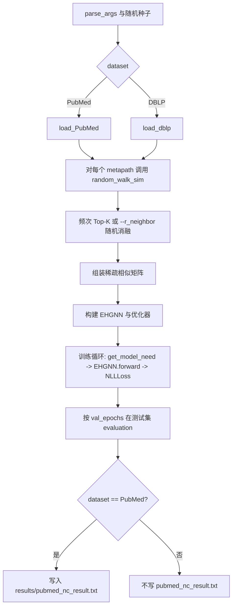

# EHGNN 项目结构与使用说明

**当前文档默认对应 Git 分支：`reproduce-baseline`。**  
该分支保留论文复现与批量脚本。**本地阶段**：Link Prediction 以 **`run_*_lp_smoke.py`** 做管线验证；**服务器正式复现**：Node Classification 与 Link Prediction 均推荐默认 **5 seeds**（`[42, 3407, 2026, 6666, 8888]`）。历史 **`run_pubmed_lp_3seeds.py`**、**`run_yelp_3seeds.py`** 等仅兼容保留。**不包含** `neighbor_strategy` / hybrid / temp（见 **`neighbor-strategy-dev`**）。

文档依据当前仓库布局整理（路径相对于仓库根目录 `EHGNN/`）。运行命令前请将工作目录切换到对应子项目。

---

## 1. 目录结构（约 2–3 层）

```
EHGNN/
├── README.md                 # 论文仓库简短说明与超参表（原版）
├── README_MAG240M.md         # MAG240M 服务器部署说明（扩展）
├── .gitignore
├── data/                     # 数据集（默认不提交 Git）
│   ├── PubMed/
│   ├── DBLP/
│   └── Yelp/
├── scripts/
│   ├── check_mag240m_data.py
│   ├── collect_result_summaries.py   # → results/ALL_SUMMARIES_INDEX.md
│   ├── run_mag240m_server.sh
│   ├── run_server_resource_monitor.sh
│   ├── server_run_core_reproduction.sh
│   ├── server_run_extended_experiments.sh
│   ├── TODO_metapath_experiments.md
│   └── TODO_hppr_strategy_study.md
├── Node Classification/
│   ├── main.py               # PubMed / DBLP 节点分类入口
│   ├── main_yelp.py          # Yelp 节点分类入口（参数集不同）
│   ├── models.py
│   ├── utils.py
│   ├── run_pubmed_5seeds.py
│   ├── run_pubmed_ablation.py
│   ├── run_nc_ablation_all_datasets.py   # Table VII NC
│   ├── run_nc_sensitivity_k.py           # Fig.2
│   ├── run_nc_sensitivity_alpha.py      # Fig.4
│   ├── run_nc_sensitivity_walk_num.py   # Table VIII
│   ├── run_dblp_5seeds.py
│   ├── run_yelp_3seeds.py    # 历史 selected 3 seeds
│   ├── run_yelp_5seeds.py    # 服务器正式 5 seeds（推荐）
│   └── results/              # NC 实验产出（默认不提交 Git）
├── Link Prediction/
│   ├── main.py               # PubMed / DBLP 链接预测
│   ├── main_yelp.py          # Yelp 链接预测
│   ├── parallel_main.py
│   ├── parallel_main_yelp.py
│   ├── models.py
│   ├── utils.py
│   ├── run_pubmed_lp_smoke.py
│   ├── run_pubmed_lp_3seeds.py   # 历史兼容
│   ├── run_pubmed_lp_5seeds.py   # 服务器正式 PubMed LP（推荐）
│   ├── run_dblp_lp_smoke.py
│   ├── run_dblp_lp_5seeds.py
│   ├── run_yelp_lp_smoke.py
│   ├── run_yelp_lp_5seeds.py
│   ├── run_lp_ablation_all_datasets.py  # Table VII LP
│   ├── run_lp_sensitivity_k.py           # Fig.3
│   ├── run_lp_sensitivity_alpha.py      # Fig.5
│   ├── run_lp_sensitivity_walk_num.py   # Table VIII
│   └── results/
└── MAG240M/
    ├── main.py
    ├── models.py
    └── utils.py
```

说明：`logs/` 在首次执行 `scripts/run_mag240m_server.sh` 时一般会创建；若尚未运行该脚本，根目录可能尚无 `logs/`。

---

## 2. 各目录作用

| 目录 | 作用 |
|------|------|
| **Node Classification** | 见上表；扩展：**`run_nc_ablation_all_datasets.py`**、**`run_nc_sensitivity_{k,alpha,walk_num}.py`**（默认 5 seeds，`--seeds` / `--skip_existing`）。 |
| **Link Prediction** | 见上表；扩展：**`run_lp_ablation_all_datasets.py`**、**`run_lp_sensitivity_{k,alpha,walk_num}.py`**。 |
| **MAG240M** | OGB-LSC MAG240M 大规模节点分类；数据根目录语义见 `README_MAG240M.md`（`mag240m_kddcup2021/`）。 |
| **scripts** | MAG240M 校验与启动；**`server_run_core_reproduction.sh`** / **`server_run_extended_experiments.sh`**；**`run_server_resource_monitor.sh`**；**`collect_result_summaries.py`**；TODO 文档见 **`TODO_metapath_experiments.md`**、**`TODO_hppr_strategy_study.md`**。 |
| **data** | 论文三组数据（PubMed / DBLP / Yelp）及可选 MAG240M 父目录（本地放置）。 |
| **Node Classification/results** | PubMed：快照、5-seed、消融；DBLP：`dblp_5seeds/`；Yelp：**`yelp_5seeds/`**（**`run_yelp_5seeds.py`**）；历史 **`yelp_3seeds/`**。 |

### 2.1 Smoke test vs 正式多 seed（与代码一致）

| 类别 | 特征 | 本仓库示例 |
|------|------|------------|
| **Smoke test** | 极少 **`epochs`** / **`val_epochs`**；验证加载、RW、训练与日志 | **`Link Prediction/run_*_lp_smoke.py`**（**不是** Table VI 指标） |
| **正式多 seed** | README 对齐超参 + 默认 **`epochs`**（入口常为 100）+ 汇总 **`summary.csv` / `summary.txt`** | **`run_*_5seeds.py`**、**`run_*_lp_5seeds.py`**；默认 seeds **`[42, 3407, 2026, 6666, 8888]`**（另有 argparse 的可切换脚本除外） |
| **历史 3-seed** | 旧目录或手动 **`--seeds 42 3407 2026`** | **`run_pubmed_lp_3seeds.py`**、**`run_yelp_3seeds.py`** — **不得**写成默认 5-seed 正式结论 |

**代码差异（勿与文档混淆）**：**`run_pubmed_5seeds.py`** 使用内置 **固定 SEEDS 列表**，且 **`subprocess.run(..., check=True)`** 写 **`pubmed_nc_result.txt`**，**无** **`--seeds` / `--skip_existing`**；其余 **`run_*_5seeds.py`**（DBLP/Yelp NC、全部 LP 正式脚本）多为 **捕获 stdout + 可选 `--skip_existing`**。引用服务器命令时以各脚本 **`python -h`** 为准。

---

## 3. `Node Classification/main.py` 如何运行

在 **`Node Classification/`** 下执行：

```bash
python main.py --dataset PubMed --path ../data/ --seed 42
```

常用默认值（与 `README.md` 中 PubMed 一行对齐）：`--alpha 0.7 --K 20 --lr 1e-3 --dropout 0.4 --hidden 256 --n_layers 4 --batch_size 3000`。

DBLP：

```bash
python main.py --dataset DBLP --path ../data/ --seed 42
```

说明：`--path` 与 `--dataset` 在代码中拼接为 `{path}{dataset}/`（注意 `path` 通常需以 `/` 结尾）。参数 `--other_path` 在 argparse 中存在；若发现未在训练流程中使用，属代码与 CLI 不一致问题，仅在此文档记录，不在此仓库本轮修改代码。

---

## 4. 批量实验命令（Node Classification / Link Prediction）

均在 **`Node Classification/`** 下：

| 实验 | 命令 |
|------|------|
| 单次 PubMed NC | `python main.py --dataset PubMed --seed <seed>` |
| 单次 DBLP NC（README 超参） | 见 **`REPRODUCTION_REPORT.md`** §5.2 |
| 5-seed（PubMed） | `python run_pubmed_5seeds.py` |
| 消融（仅 PubMed NC，历史脚本） | `python run_pubmed_ablation.py` |
| NC 全数据集消融（Table VII） | `python run_nc_ablation_all_datasets.py`（支持 **`--seeds`、`--skip_existing`**） |
| NC K / α / walk_num 敏感性 | `python run_nc_sensitivity_k.py` 等（同上） |
| DBLP 多 seed | `python run_dblp_5seeds.py`（默认 5 seeds；支持 **`--seeds`、`--skip_existing`**） |
| Yelp 多 seed（README；**服务器正式 5 seeds**） | `python run_yelp_5seeds.py`（可选 `--seeds`、`--skip_existing`） |
| Yelp 多 seed（历史 **3 seeds**） | `python run_yelp_3seeds.py` |

均在 **`Link Prediction/`** 下：

| 实验 | 命令 |
|------|------|
| LP smoke（PubMed / DBLP / Yelp） | `python run_pubmed_lp_smoke.py` 等 |
| LP 正式 5-seed（Table VI） | `python run_pubmed_lp_5seeds.py`（支持 **`--seeds`、`--skip_existing`**）等 |
| LP 全数据集消融 / 敏感性 | `python run_lp_ablation_all_datasets.py`、`python run_lp_sensitivity_k.py` 等 |

**服务器串联**：**`bash scripts/server_run_core_reproduction.sh`**、**`bash scripts/server_run_extended_experiments.sh`**（见 §10）。

`main.py` 默认 RW 后为 **频次 Top-K**；`--r_neighbor` 为随机邻居消融。**DBLP / Yelp NC**：文档中的 **3-seed** 表格仅为历史 selected 切片；**正式服务器复现以 `run_*_5seeds.py` 默认 5 seeds 为准**。

---

## 5. 数据集选择：`--dataset` / `--path`

| 任务 | 入口 | 选择方式 |
|------|------|----------|
| PubMed NC | `main.py` | `--dataset PubMed`，数据目录 `{path}PubMed/` |
| DBLP NC | `main.py` | `--dataset DBLP`，数据目录 `{path}DBLP/` |
| Yelp NC | `main_yelp.py` | 默认 `--dataset Yelp`，`{path}Yelp/` |

仓库根 `README.md` 说明数据可置于 **`../data`**（相对于各子目录运行时即为仓库旁的 `data/`；当前常见做法是使用 **`Node Classification/../data`**，即仓库根下 `data/`）。

---

## 6. MAG240M：`--data_root` / `--path`

在 **`MAG240M/`** 下运行 `main.py`（见 `README_MAG240M.md`）：

```bash
cd MAG240M
python main.py --data_root ~/data --gpu 0
```

- `--data_root` 若设置则覆盖 `--path`。  
- 二者均为 **`MAG240MDataset(root=...)` 的父目录**；完整数据位于 **`{root}/mag240m_kddcup2021/`**。

校验（在仓库根）：

```bash
python scripts/check_mag240m_data.py --root /path/to/parent
```

---

## 7. `results/` 各子目录内容

路径：**`Node Classification/results/`**（默认 `.gitignore` 忽略）。

| 路径 | 内容 |
|------|------|
| `pubmed_nc_result.txt` | 最近一次 PubMed 运行的指标快照（会被下一次 PubMed 运行覆盖）。 |
| `pubmed_5seeds/` | 五种子运行副本、`pubmed_5seeds_summary.csv`、`pubmed_5seeds_summary.txt`。 |
| `pubmed_ablation/` | 消融各配置 × seed 的 txt、`summary.csv`、`summary.txt`。 |
| `dblp_5seeds/` | DBLP 多 seed：`summary.csv`、`summary.txt`、各 `dblp_seed_*.log`。**`run_dblp_5seeds.py` 默认 5 seeds**；文档中 **3-seed** 摘录仅为历史 selected 切片。 |
| `nc_ablation_all_datasets/` | **`run_nc_ablation_all_datasets.py`** |
| `nc_sensitivity_k/`、`nc_sensitivity_alpha/`、`nc_sensitivity_walk_num/` | 参数敏感性（Fig.2/4、Table VIII） |
| `yelp_5seeds/` | **`run_yelp_5seeds.py`**：默认 5 seeds，`summary.csv` / `summary.txt`。 |
| `yelp_3seeds/` | 历史 **`run_yelp_3seeds.py`**：**selected 3 seeds**。测试 F1 **跨 seed 完全相同**等症结见 **`EXPERIMENT_NOTES.md`** §4。 |

（历史目录如 `pubmed_neighbor_strategy/`、`pubmed_hybrid_ratio_sweep/` 若仍存在，来自 **`neighbor-strategy-dev`** 实验，本分支不再提供对应脚本。）

### `Link Prediction/results/`（默认 `.gitignore`）

| 路径 | 内容 |
|------|------|
| `pubmed_lp_smoke/` | **`run_pubmed_lp_smoke.py`** |
| `pubmed_lp_5seeds/` | **`run_pubmed_lp_5seeds.py`**（正式）；`pubmed_lp_3seeds/` 为旧版 3-seed 兼容 |
| `dblp_lp_smoke/`、`dblp_lp_5seeds/` | DBLP LP smoke / 正式 5 seeds |
| `yelp_lp_smoke/`、`yelp_lp_5seeds/` | Yelp LP smoke / 正式 5 seeds |
| `lp_ablation_all_datasets/` | **`run_lp_ablation_all_datasets.py`** |
| `lp_sensitivity_k/`、`lp_sensitivity_alpha/`、`lp_sensitivity_walk_num/` | LP 参数敏感性（Fig.3/5、Table VIII） |

### 仓库根 `results/`（若存在）

- **`collect_result_summaries.py`** 会写入 **`EHGNN/results/ALL_SUMMARIES_INDEX.md`**（扫描各 `**/summary.*` 的路径索引）。
- 整个 **`results/`** 目录位于 **`.gitignore`** 的 **`**/results/`** 规则下；**不要提交**该索引文件入 Git（仅服务器 / 本地制品）。

---

## 8. 代码流程图（PubMed / DBLP，`main.py`）



说明：`main_yelp.py` 与 **`MAG240M/main.py`** 的数据加载与前向接口与此不完全相同；MAG240M 使用 **`MAG240M/utils.py`** 中的 `random_walk_sim`，与 NC 版工具函数不是同一份文件。

---

## 9. 已知文档层记录

- **`Link Prediction`** 与 **`MAG240M`** 的入口参数、默认超参与 **`Node Classification/main.py`** 不一致，需各自查看对应 `parse_args()`。  
- **`reproduce-baseline`**：`Node Classification/utils.random_walk_sim` 仅频次 Top-K 与 `--r_neighbor`；扩展邻居策略仅在 **`neighbor-strategy-dev`**。

---

## 10. 服务器正式批量命令（摘录）

与 **`EXPERIMENT_NOTES.md`** §8.1 一致。

**Node Classification**

```bash
cd ~/EHGNN/"Node Classification"
conda activate ehgnn

python run_pubmed_5seeds.py
python run_dblp_5seeds.py --seeds 42 3407 2026 6666 8888 --skip_existing
python run_yelp_5seeds.py --seeds 42 3407 2026 6666 8888 --skip_existing
```

**Link Prediction**

```bash
cd ~/EHGNN/"Link Prediction"
conda activate ehgnn

python run_pubmed_lp_5seeds.py --seeds 42 3407 2026 6666 8888 --skip_existing
python run_dblp_lp_5seeds.py --seeds 42 3407 2026 6666 8888 --skip_existing
python run_yelp_lp_5seeds.py --seeds 42 3407 2026 6666 8888 --skip_existing
```

**MAG240M**

```bash
cd ~/EHGNN
conda activate ehgnn

export MAG240_DATA_ROOT="$HOME/data"
python scripts/check_mag240m_data.py --root "$MAG240_DATA_ROOT"

chmod +x scripts/run_mag240m_server.sh
./scripts/run_mag240m_server.sh
```

### Core vs extended（服务器）

- **主结果（先做）**：`bash scripts/server_run_core_reproduction.sh`（tee 到 `logs/server_core_reproduction.log`）。需事先 **`conda activate`** 等与单机脚本相同前提。
- **消融与敏感性（后做）**：`bash scripts/server_run_extended_experiments.sh` → `logs/server_extended_experiments.log`。
- **资源采样**：`bash scripts/run_server_resource_monitor.sh '<your long command>'`。
- **汇总索引**：`python scripts/collect_result_summaries.py`。
