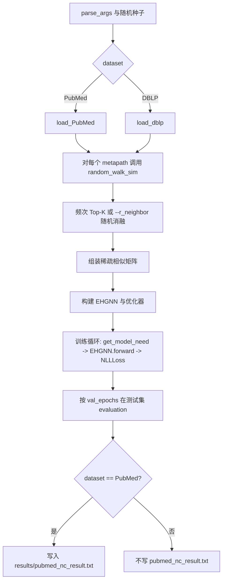

# EHGNN 项目结构与使用说明

**当前文档默认对应 Git 分支：`reproduce-baseline`。**  
该分支保留论文复现与批量脚本（PubMed：5-seed、消融；DBLP：`run_dblp_5seeds.py` 等）；**不包含** `neighbor_strategy` / hybrid / temp 等邻居策略扩展（见分支 **`neighbor-strategy-dev`**）。

文档依据当前仓库布局整理（路径相对于仓库根目录 `EHGNN/`）。运行命令前请将工作目录切换到对应子项目。

---

## 1. 目录结构（约 2–3 层）

```
EHGNN/
├── README.md                 # 论文仓库简短说明与超参表（原版）
├── README_MAG240M.md         # MAG240M 服务器部署说明（扩展）
├── .gitignore
├── data/                     # 数据集（默认不提交 Git）
│   ├── PubMed/
│   ├── DBLP/
│   └── Yelp/
├── scripts/
│   ├── check_mag240m_data.py
│   └── run_mag240m_server.sh
├── Node Classification/
│   ├── main.py               # PubMed / DBLP 节点分类入口
│   ├── main_yelp.py          # Yelp 节点分类入口（参数集不同）
│   ├── models.py
│   ├── utils.py
│   ├── run_pubmed_5seeds.py
│   ├── run_pubmed_ablation.py
│   ├── run_dblp_5seeds.py
│   └── results/              # NC 实验产出（默认不提交 Git）
├── Link Prediction/
│   ├── main.py
│   ├── main_yelp.py
│   ├── parallel_main.py
│   ├── parallel_main_yelp.py
│   ├── models.py
│   └── utils.py
└── MAG240M/
    ├── main.py
    ├── models.py
    └── utils.py
```

说明：`logs/` 在首次执行 `scripts/run_mag240m_server.sh` 时一般会创建；若尚未运行该脚本，根目录可能尚无 `logs/`。

---

## 2. 各目录作用

| 目录 | 作用 |
|------|------|
| **Node Classification** | PubMed / DBLP 节点分类（`main.py`）；Yelp 用 `main_yelp.py`。含 RW 相似度、`EHGNN`、训练；`run_pubmed_5seeds.py` / `run_pubmed_ablation.py`；DBLP 多 seed 可用 `run_dblp_5seeds.py`；`results/`。 |
| **Link Prediction** | 链接预测：`main.py` / `main_yelp.py`；并行版本 `parallel_main*.py`（依赖等与 NC 不同）。 |
| **MAG240M** | OGB-LSC MAG240M 大规模节点分类；数据根目录语义见 `README_MAG240M.md`（`mag240m_kddcup2021/`）。 |
| **scripts** | MAG240M：数据校验脚本与 Linux 一键启动脚本。 |
| **data** | 论文三组数据（PubMed / DBLP / Yelp）及可选 MAG240M 父目录（本地放置）。 |
| **Node Classification/results** | PubMed：单次快照、5-seed、消融；**DBLP**：`dblp_5seeds/`（`run_dblp_5seeds.py` 汇总，含 selected seeds 的 `summary.txt`）；若本地仍留有历史邻居策略目录，为其它分支产物。 |

---

## 3. `Node Classification/main.py` 如何运行

在 **`Node Classification/`** 下执行：

```bash
python main.py --dataset PubMed --path ../data/ --seed 42
```

常用默认值（与 `README.md` 中 PubMed 一行对齐）：`--alpha 0.7 --K 20 --lr 1e-3 --dropout 0.4 --hidden 256 --n_layers 4 --batch_size 3000`。

DBLP：

```bash
python main.py --dataset DBLP --path ../data/ --seed 42
```

说明：`--path` 与 `--dataset` 在代码中拼接为 `{path}{dataset}/`（注意 `path` 通常需以 `/` 结尾）。参数 `--other_path` 在 argparse 中存在；若发现未在训练流程中使用，属代码与 CLI 不一致问题，仅在此文档记录，不在此仓库本轮修改代码。

---

## 4. PubMed 批量实验命令

均在 **`Node Classification/`** 下：

| 实验 | 命令 |
|------|------|
| 单次 PubMed NC | `python main.py --dataset PubMed --seed <seed>` |
| 单次 DBLP NC（README 超参） | 见 **`REPRODUCTION_REPORT.md`** §5.2 |
| 5-seed（PubMed） | `python run_pubmed_5seeds.py` |
| 消融（PubMed） | `python run_pubmed_ablation.py` |
| DBLP 多 seed（可选 `--seeds`，不写 PubMed txt） | `python run_dblp_5seeds.py`（如 `--seeds 42 3407 2026`） |

`main.py` 默认 RW 后为 **频次 Top-K**；`--r_neighbor` 为随机邻居消融。当前文档中 **DBLP baseline 数值**为 **selected 3 seeds**（非 5），见 `results/dblp_5seeds/summary.txt` 与 **`EXPERIMENT_NOTES.md`**。

---

## 5. 数据集选择：`--dataset` / `--path`

| 任务 | 入口 | 选择方式 |
|------|------|----------|
| PubMed NC | `main.py` | `--dataset PubMed`，数据目录 `{path}PubMed/` |
| DBLP NC | `main.py` | `--dataset DBLP`，数据目录 `{path}DBLP/` |
| Yelp NC | `main_yelp.py` | 默认 `--dataset Yelp`，`{path}Yelp/` |

仓库根 `README.md` 说明数据可置于 **`../data`**（相对于各子目录运行时即为仓库旁的 `data/`；当前常见做法是使用 **`Node Classification/../data`**，即仓库根下 `data/`）。

---

## 6. MAG240M：`--data_root` / `--path`

在 **`MAG240M/`** 下运行 `main.py`（见 `README_MAG240M.md`）：

```bash
cd MAG240M
python main.py --data_root ~/data --gpu 0
```

- `--data_root` 若设置则覆盖 `--path`。  
- 二者均为 **`MAG240MDataset(root=...)` 的父目录**；完整数据位于 **`{root}/mag240m_kddcup2021/`**。

校验（在仓库根）：

```bash
python scripts/check_mag240m_data.py --root /path/to/parent
```

---

## 7. `results/` 各子目录内容

路径：**`Node Classification/results/`**（默认 `.gitignore` 忽略）。

| 路径 | 内容 |
|------|------|
| `pubmed_nc_result.txt` | 最近一次 PubMed 运行的指标快照（会被下一次 PubMed 运行覆盖）。 |
| `pubmed_5seeds/` | 五种子运行副本、`pubmed_5seeds_summary.csv`、`pubmed_5seeds_summary.txt`。 |
| `pubmed_ablation/` | 消融各配置 × seed 的 txt、`summary.csv`、`summary.txt`。 |
| `dblp_5seeds/` | DBLP 多 seed：`summary.csv`、`summary.txt`、各 `dblp_seed_*.log`（**汇总种子数以脚本本次 `--seeds` 为准**；文档当前记录为 **3 seed**）。 |

（历史目录如 `pubmed_neighbor_strategy/`、`pubmed_hybrid_ratio_sweep/` 若仍存在，来自 **`neighbor-strategy-dev`** 实验，本分支不再提供对应脚本。）

---

## 8. 代码流程图（PubMed / DBLP，`main.py`）



说明：`main_yelp.py` 与 **`MAG240M/main.py`** 的数据加载与前向接口与此不完全相同；MAG240M 使用 **`MAG240M/utils.py`** 中的 `random_walk_sim`，与 NC 版工具函数不是同一份文件。

---

## 9. 已知文档层记录

- **`Link Prediction`** 与 **`MAG240M`** 的入口参数、默认超参与 **`Node Classification/main.py`** 不一致，需各自查看对应 `parse_args()`。  
- **`reproduce-baseline`**：`Node Classification/utils.random_walk_sim` 仅频次 Top-K 与 `--r_neighbor`；扩展邻居策略仅在 **`neighbor-strategy-dev`**。
